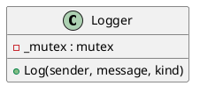

# Logger

## [IMPL-CLASSES-001] Description
The `Logger` class implements `Smp::Services::ILogger`. It provides a centralized logging mechanism for the simulation, allowing components to report information, warnings, and errors. It currently outputs to `std::cout` with thread-safe access.

## [IMPL-CLASSES-002] Methods
- `void Log(const IObject *sender, String8 message, LogMessageKind kind)`: Logs a message from a specific sender.
- `LogMessageKind QueryLogMessageKind(String8 messageKindName)`: Returns a unique ID for a custom log message category.

## [IMPL-CLASSES-003] Attributes
- `_mutex`: `std::mutex` - Ensures thread-safe access to the console output.

## [IMPL-CLASSES-004] Relations
- Implements `Smp::Services::ILogger`.
- Used by all components and services in the simulation.

## [IMPL-CLASSES-005] Dependencies
- `Smp/Services/ILogger.h`

## [IMPL-CLASSES-006] Tests
- Implicitly used in all integration tests.

## [IMPL-CLASSES-007] Examples
- Logging a message:
  ```cpp
  logger->Log(this, "Initialising simulation...", 1);
  ```

## [IMPL-CLASSES-008] Class Diagram

