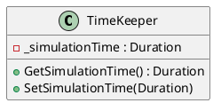

# TimeKeeper

## [IMPL-CLASSES-001] Description
The `TimeKeeper` class implements `Smp::Services::ITimeKeeper`. It maintains the various time references used in the simulation, including Simulation Time, Mission Time, Epoch Time, and Zulu Time. It is used by the Scheduler to determine event execution times.

## [IMPL-CLASSES-002] Methods
- `Duration GetSimulationTime()`: Returns the current simulation time.
- `DateTime GetZuluTime()`: Returns the current real-world (Zulu) time.
- `void SetSimulationTime(Duration time)`: Updates the current simulation time (typically called by the Simulator).
- `void SetEpochTime(DateTime epochTime)`: Sets the epoch reference time.

## [IMPL-CLASSES-003] Attributes
- `_simulationTime`: `Duration` - Current time in the simulation.
- `_epochOffset`: `DateTime` - Reference time for epoch calculations.
- `_missionStart`: `DateTime` - Start time of the mission.

## [IMPL-CLASSES-004] Relations
- Implements `Smp::Services::ITimeKeeper`.
- Used by the `Scheduler` and other simulation services.

## [IMPL-CLASSES-005] Dependencies
- `Smp/Services/ITimeKeeper.h`

## [IMPL-CLASSES-006] Tests
- Verified in `test_basic_simulation.cpp`.

## [IMPL-CLASSES-008] Class Diagram

