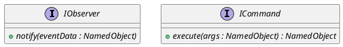

# Core Interfaces

The Quasar framework defines several fundamental interfaces to support decoupling, reflexivity, and event-driven architectures.

## IObserver

### [IMPL-CLASSES-001] Description
The `IObserver` interface is the core component of the project's publish-subscribe mechanism. It allows objects to register interest in events or state changes from `ActiveEntity` producers. When an event occurs, the producer invokes the `notify` method on all registered observers.

### [IMPL-CLASSES-002] Methods
- `notify(eventData)`: Pure virtual method. Consumes an event payload as a `NamedObject` tree.

---

## ICommand

### [IMPL-CLASSES-001] Description
The `ICommand` interface provides a standardized contract for reflexive method execution. It is the underlying functional type for `NamedMethod` and is used to expose system capabilities dynamically. 

By abstracting execution into a single `execute` call that takes and returns a `NamedObject` tree, Quasar achieves full uniformity between C++, Lua, and remote API calls.

### [IMPL-CLASSES-002] Methods
- `execute(args)`: Pure virtual method. Performs the operation and returns a result tree.

### [IMPL-CLASSES-008] Class Diagram

