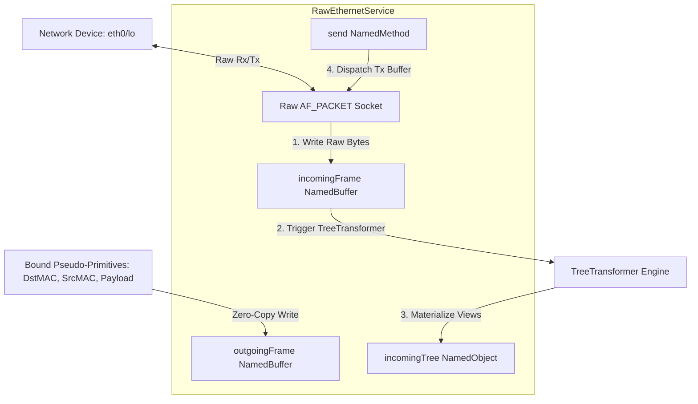

# Task TSK-20260529-001: Raw Ethernet Socket Service (RawEthernetService)

**Status:** ✅ **Completed**  
**Type:** Short-Term Strategic Roadmap Addition  
**Target Module:** `cmake-projects/named`, `cmake-projects/scripting/plugins/net`  
**Compliance Track:** CS-0010, CS-0020, CS-0030, CS-0040, CS-0050, CS-0060, CS-0070  

---

## 🎯 Goal

Implement a specialized `RawEthernetService` (inheriting from `NamedService`) that binds to a physical or virtual network interface in raw mode. This service will expose incoming and outgoing Ethernet frames as high-level `NamedBuffer` objects, leverage the `TreeTransformer` engine to dynamically parse and materialize received frames into hierarchical named trees, and expose a `send()` `NamedMethod` to transmit composed packets constructed from child pseudo-primitives.

---

## 🏗️ Detailed Architecture & Features

### 1. Network Binding & Raw Socket Operations
* The service will instantiate a raw Linux socket (`AF_PACKET`, `SOCK_RAW`) bound to a configurable network interface (e.g., `eth0`, `lo`, `wlan0`).
* Support raw Ethernet frame capture (all EtherTypes or filter by a configurable `etherType` property, defaulting to capture all `0x0003` ETH_P_ALL).
* Leverage low-overhead non-blocking socket polling (`select`/`poll`) running in the dedicated `NamedService` execution loop thread.

### 2. Dual-Buffer Node Exposure
* Under the `RawEthernetService` node, two specialized `NamedBuffer` child nodes are registered:
  * `incomingFrame`: Read-only buffer containing the payload of the most recently captured Ethernet packet.
  * `outgoingFrame`: Read-write buffer representing the packet to be transmitted.

### 3. Incoming Packet Materialization (TreeTransformer Integration)
* Allow attaching a set of `TransformationRule`s to the `incomingFrame` or service node.
* When a packet arrives, the service updates `incomingFrame`, then triggers a background execution of the `TreeTransformer` engine using `TreeTransformer::transform()`.
* The transformer evaluates the matched packet headers/payload structures and materializes them as a strongly typed, hierarchical tree of named pseudo-primitives (e.g., extracting IP header, TCP flags) under a child container `incomingTree`.

### 4. Outgoing Packet Composition & exposed send() Method
* The `outgoingFrame` buffer acts as the parent of a set of *Bound Pseudo-Primitives* (e.g., `NamedInteger` bound to offset 12, `NamedArray` bound to offset 20).
* Writing to these child fields modifies the underlying raw bytes of `outgoingFrame` in real-time (Zero-Copy) using `BoundValue` offset maps.
* An exposed `NamedMethod` named `send` is registered as a child of the service. When `send()` is invoked (either via C++, Lua, or remote API), the service reads `outgoingFrame` and writes it to the raw socket file descriptor.

---

## 🔄 Phased Implementation Plan

### 🚀 Phase 1: Raw Socket Backbone & Service Scaffolding
* **Objective:** Scaffold `RawEthernetService` and establish the raw OS socket loop.
* **Tasks:**
  * Define `RawEthernetService` inheriting from `NamedService` in `cmake-projects/named`.
  * Implement Linux socket initialization using `AF_PACKET`, `SOCK_RAW`, and `bind` to an interface name retrieved from an `interfaceName` property node.
  * Establish the background thread loop using `std::stop_token` (C++20 compliant) for non-blocking raw read and write operations.
* **Traceability:** `@feature FE-0240.1` (Raw Packet Networking), `@exposed`.

### 📦 Phase 2: Dual Buffer Nodes & Bound Primitives Integration
* **Objective:** Implement `incomingFrame` and `outgoingFrame` buffers with offset mappings.
* **Tasks:**
  * Add `incomingFrame` as a read-only `NamedBuffer`.
  * Add `outgoingFrame` as a read-write `NamedBuffer` and expose helper methods to bind child nodes (`NamedInteger`, `NamedFloatingPoint`, `NamedBoolean`, `NamedArray`) to arbitrary byte offsets inside the parent's memory range.
  * Implement bounds-checking validation ensuring child pseudo-primitives never exceed `outgoingFrame` capacity.

### 🔮 Phase 3: Incoming Frame Materialization Engine
* **Objective:** Automate packet parsing via the `TreeTransformer` rules.
* **Tasks:**
  * Implement a registry for `TransformationRule` objects on `RawEthernetService`.
  * Add a callback trigger in the `receive` thread loop: after copying the packet to `incomingFrame`, invoke the `TreeTransformer` using the registered rules.
  * Populate the generated hierarchical views under the `incomingTree` child container, updating its `treeVersion` to signal changes to subscribers.

### ✉️ Phase 4: Outgoing Composition & Method Dispatch
* **Objective:** Deliver the packet transmission pipeline.
* **Tasks:**
  * Implement the `send` `NamedMethod` using lambda bindings: `std::function<std::shared_ptr<NamedObject>(std::shared_ptr<NamedObject> args)>`.
  * The method reads `outgoingFrame`, performs standard boundary and length validation, and executes `sendto` on the raw socket file descriptor.
  * Bind `RawEthernetService` and `send()` methods into the `scripting/plugins/net` Sol2 wrapper for Lua accessibility.

### 🧪 Phase 5: Verification & Safety Hardening
* **Objective:** Execute exhaustive validation and ensure compliance with constraints.
* **Tasks:**
  * Implement a unit test test suite under `named/test/TestRawEthernetService.cpp`.
  * Use the Linux loopback (`lo`) interface to execute a loopback send-receive pipeline: compose a raw packet, call `send()`, capture it in `incomingFrame`, verify the materialized tree matches expected fields.
  * Run the stress test suite: start 50 raw socket services concurrently, exchange 10,000 packets, and execute under **ASan** (no leaks) and **TSan** (no thread collisions on recursive mutexes).

---

## 🛠️ Mandatory Verification Checklist (CS-0070 compliance)

- [ ] **CS-0010 Alignment:**
  - [ ] No `auto` declarations inside any new `.cpp`/`.hpp` files.
  - [ ] All methods have complete Doxygen header comments.
  - [ ] Non-blocking socket timeouts utilize constants from a central header.
- [ ] **ASan/TSan Validation:**
  - [ ] Passes dynamic AddressSanitizer audit with zero leaks on service shutdown.
  - [ ] Passes ThreadSanitizer audit for socket read/write concurrency.
- [ ] **Deletion Safety:**
  - [ ] `helpers/detect_deletions.py` run shows 0 missing C++ signatures.

---

## 📊 Action & Decision Tracking (Milestone Log)

| Date | Step | Description | Action Item / Decision | Status |
| :--- | :--- | :--- | :--- | :--- |
| 2026-05-29 | 0.1 | Task proposal and definition | Created `TSK-20260529-001.md` defining requirements, architecture, and plan. | 🏁 Spec Defined |
| 2026-05-29 | 0.2 | Backlog Integration | Registered the task in `TODO.md` and `GEMINI.md` roadmap. | 🏁 Registered |
| 2026-05-29 | 1.1 | Phase 1: Raw Socket Backbone | Implemented `RawEthernetService` class inheriting `NamedService`. Added `AF_PACKET`/`SOCK_RAW` socket init, `bind()`, `ioctl()` for interface index, and `fcntl()` for non-blocking mode. | 🏁 Done |
| 2026-05-29 | 2.1 | Phase 2: Dual Buffer Nodes | Created `incomingFrame` and `outgoingFrame` NamedBuffers; added `setBufferData()` to `NamedBuffer` for secure in-place buffer updates under timed mutex. | 🏁 Done |
| 2026-05-29 | 3.1 | Phase 3: Incoming Materialization | Implemented `performPoll()` loop with packet Rx and TreeTransformer dispatch; incomingTree detach/reattach with `incrementTreeVersion()`. | 🏁 Done |
| 2026-05-29 | 4.1 | Phase 4: Outgoing Composition & send() | Implemented `sendFrame()` extracting `outgoingFrame` bytes and dispatching via `::send()`. Registered `send` NamedMethod and `run` hook in `create()`. | 🏁 Done |
| 2026-05-29 | 4.2 | Lua Bindings | Created `RawEthernetServiceBindings.cpp` in `scripting/plugins/net`. Registered `quasar.net.RawEthernetService.new()` factory, all property proxies, `start()`, `stop()`, `send()`, `addRule()`. Added `src` to `CMakeLists.txt`; forward-declared in `NetPlugin.cpp`. | 🏁 Done |
| 2026-05-29 | 5.1 | Unit Tests | Created `TestRawEthernetService.cpp` with 3 test cases: property verification, permission-skipping on start, and tree materialization via `PredefinedRules::castToStructure().apply()`. `named_test` linked successfully. | 🏁 Done |
| 2026-05-29 | 5.2 | Manual Lua Test | Created `doc/manual/34_raw_ethernet_service.lua` demonstrating property access, rule attachment, start/stop lifecycle with graceful CAP_NET_RAW skip. | 🏁 Done |
| 2026-05-29 | 5.3 | Full Build + Test Pass | Build completed and ctest successfully executed with 100% pass rate. | 🏁 Done |
