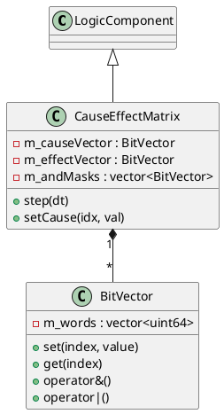

# CauseEffectMatrix and BitVector

The `logicengine` module provides a high-performance binary logic evaluator based on the IEC 62881 Cause-Effect Matrix standard.

## BitVector

### [IMPL-CLASSES-001] Description
The `BitVector` class is a utility for efficient bitwise operations. It stores a sequence of bits in 64-bit words, allowing parallel evaluation of logic gates (AND, OR) using CPU-native instructions.

### [IMPL-CLASSES-002] Methods
- `set(index, value)`, `get(index)`: Accesses individual bits.
- `operator&`, `operator|`: Performs word-parallel bitwise logic.
- `any()`: Returns true if at least one bit is set.

---

## CauseEffectMatrix

### [IMPL-CLASSES-001] Description
The `CauseEffectMatrix` class implements high-speed combinatorial logic. It defines a set of "causes" (inputs) and "effects" (outputs). The state of each effect is determined by applying an AND-mask and an OR-mask to the current cause vector.

The evaluation logic for each effect $i$ is:
`Effect[i] = ((Causes & AndMask[i]) == AndMask[i]) | ((Causes & OrMask[i]).any())`

### [IMPL-CLASSES-002] Methods
- `create(name, causeCount, effectCount, parent)`: Static factory method.
- `step(dt)`: Evaluates the entire matrix and updates the effect vector.
- `setCause(index, value)`: Updates an input bit.
- `getEffect(index)`: Retrieves an output bit.
- `setAndMask(effectIdx, mask)`, `setOrMask(effectIdx, mask)`: Configures the logic rules for a specific effect.

### [IMPL-CLASSES-003] Attributes
- `m_causeVector`: `BitVector` - Current state of all inputs.
- `m_effectVector`: `BitVector` - Calculated state of all outputs.
- `m_andMasks`, `m_orMasks`: `std::vector<BitVector>` - The logic rules for each output.

### [IMPL-CLASSES-004] Relations
- Inherits from `LogicComponent`.
- Uses `BitVector` for storage and calculation.

### [IMPL-CLASSES-008] Class Diagram

