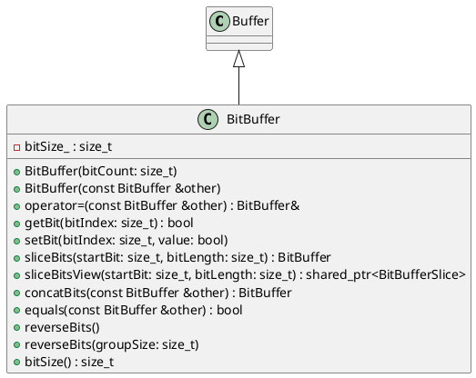

# BitBuffer

## [IMPL-CLASSES-001] Description
The `BitBuffer` class is a specialized `Buffer` that provides bit-level manipulation capabilities. It allows setting, getting, slicing, concatenating, and reversing data at the bit level, rather than just the byte level. It inherits the thread-safety mechanisms from `Buffer`.

## [IMPL-CLASSES-002] Methods
- `BitBuffer(size_t bitCount)`: Constructs a buffer with the capacity to hold `bitCount` bits.
- `BitBuffer(const BitBuffer &other)`: Copy constructor.
- `BitBuffer &operator=(const BitBuffer &other)`: Assignment operator.
- `bool getBit(size_t bitIndex) const`: Returns the state (true/false) of the bit at the specified index.
- `void setBit(size_t bitIndex, bool value)`: Sets the bit at the specified index to the given value.
- `BitBuffer sliceBits(size_t startBit, size_t bitLength) const`: Creates a new `BitBuffer` containing a slice of bits. Throws `std::out_of_range`.
- `std::shared_ptr<BitBufferSlice> sliceBitsView(size_t startBit, size_t bitLength)`: Creates a view slice at the bit level.
- `BitBuffer concatBits(const BitBuffer &other) const`: Concatenates this bit buffer with another.
- `bool equals(const BitBuffer &other) const`: Checks if two bit buffers are equal.
- `void reverseBits()`: Reverses all bits in the buffer.
- `void reverseBits(size_t groupSize)`: Reverses bits in groups of `groupSize`.
- `size_t bitSize() const`: Returns the number of valid bits in the buffer.

## [IMPL-CLASSES-003] Attributes
- `bitSize_`: `size_t` - The number of valid bits in the buffer.

## [IMPL-CLASSES-004] Relations
- `BitBufferSlice`: `BitBuffer` creates `BitBufferSlice` via `sliceBitsView`.

## [IMPL-CLASSES-005] Dependencies
- `Buffer` (Base class)

## [IMPL-CLASSES-006] Tests
- `TestBitBuffer.cpp`:
    - `GetSetBit`: Verifies setting and getting individual bits.
    - `BitSize`: Verifies bit count reporting.
    - `SliceBits`: Verifies bit-level slicing logic.
    - `ConcatBits`: Verifies concatenation of bit streams.
    - `ReverseBits`: Verifies full bit reversal.
    - `ReverseBitsGroup`: Verifies group-based bit reversal.
    - `OutOfRange`: Verifies error handling for invalid indices.
    - `Performance_GetSet`: Checks performance of bit operations.
    - `ThreadSafety`: checks concurrent access.

## [IMPL-CLASSES-007] Examples
- Setting bits:
  ```cpp
  BitBuffer bb(16);
  bb.setBit(0, true);
  ```
- Reversing bits:
  ```cpp
  bb.reverseBits();
  ```

## [IMPL-CLASSES-008] Class Diagram

