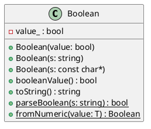

# Boolean

## [IMPL-CLASSES-001] Description
The `Boolean` class wraps a primitive `bool` value in an object. It provides helper methods for string parsing and conversion. It is immutable and thread-safe.

## [IMPL-CLASSES-002] Methods
- `Boolean(bool value)`: Constructs a Boolean from a primitive value.
- `Boolean(const std::string &s)`: Constructs a Boolean from a string (case-insensitive "true" is true, otherwise false).
- `Boolean(const char *s)`: Constructs a Boolean from a C-string.
- `bool booleanValue() const`: Returns the primitive boolean value.
- `std::string toString() const`: Returns "true" or "false".
- `static bool parseBoolean(const std::string &s)`: Parses string to boolean implementation.
- `static Boolean fromNumeric(T value)`: Creates Boolean from numeric value (0 is false, others true).

## [IMPL-CLASSES-003] Attributes
- `value_`: `bool` - The primitive value.

## [IMPL-CLASSES-004] Relations
- None.

## [IMPL-CLASSES-005] Dependencies
- `std::string`

## [IMPL-CLASSES-006] Tests
- `TestBoolean.cpp`:
    - Tests for constructor logic (bool, string).
    - Tests for `parseBoolean` behavior.
    - Tests for `fromNumeric` template.

## [IMPL-CLASSES-007] Examples
- Creating from string:
  ```cpp
  Boolean b("True"); // b.booleanValue() is true
  ```
- Creating from number:
  ```cpp
  auto b = Boolean::fromNumeric(42); // true
  ```

## [IMPL-CLASSES-008] Class Diagram

