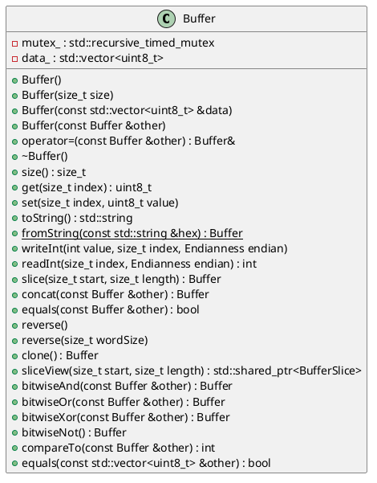

# Buffer

## [IMPL-CLASSES-001] Description
The `Buffer` class is a wrapper around a raw byte array. It provides methods for encoding/decoding, slicing, concatenation, and comparison of byte data. It ensures thread-safe operations using an internal mutex.

## [IMPL-CLASSES-002] Methods
- `Buffer()`: Constructs an empty buffer.
- `Buffer(size_t size)`: Constructs a buffer with specified size, initialized to zero.
- `Buffer(const std::vector<uint8_t> &data)`: Constructs a buffer from a vector of bytes.
- `Buffer(const Buffer &other)`: Copy constructor. Thread-safe copy.
- `Buffer &operator=(const Buffer &other)`: Assignment operator. Thread-safe assignment.
- `~Buffer()`: Destructor.
- `size_t size() const`: Returns the size of the buffer.
- `uint8_t get(size_t index) const`: Gets a byte at the specified index. Throws `std::out_of_range`.
- `void set(size_t index, uint8_t value)`: Sets a byte at the specified index. Throws `std::out_of_range`.
- `std::string toString() const`: Returns a hex string representation of the buffer.
- `static Buffer fromString(const std::string &hex)`: Creates a buffer from a hex string.
- `void writeInt(int value, size_t index, Endianness endian)`: Writes an integer to the buffer at the specified index with given endianness.
- `int readInt(size_t index, Endianness endian) const`: Reads an integer from the buffer at the specified index with given endianness.
- `Buffer slice(size_t start, size_t length) const`: Returns a new Buffer containing a slice of the original data. Throws `std::out_of_range`.
- `Buffer concat(const Buffer &other) const`: Concatenates this buffer with another and returns the result.
- `bool equals(const Buffer &other) const`: Checks if two buffers are equal.
- `void reverse()`: Reverses the buffer content.
- `void reverse(size_t wordSize)`: Reverses the buffer in chunks of `wordSize`. Throws `std::invalid_argument`.
- `Buffer clone() const`: Creates a deep copy of the buffer.
- `std::shared_ptr<BufferSlice> sliceView(size_t start, size_t length)`: Creates a slice view of the buffer.
- `Buffer bitwiseAnd(const Buffer &other) const`: Performs bitwise AND with another buffer.
- `Buffer bitwiseOr(const Buffer &other) const`: Performs bitwise OR with another buffer.
- `Buffer bitwiseXor(const Buffer &other) const`: Performs bitwise XOR with another buffer.
- `Buffer bitwiseNot() const`: Performs bitwise NOT.
- `int compareTo(const Buffer &other) const`: Compares two buffers lexicographically.
- `bool equals(const std::vector<uint8_t> &other) const`: Checks equality with a raw vector.

## [IMPL-CLASSES-003] Attributes
- `mutex_`: `mutable std::recursive_timed_mutex` - Mutex for thread safety.
- `data_`: `std::vector<uint8_t>` - The raw byte data.

## [IMPL-CLASSES-004] Relations
- `BufferSlice`: `Buffer` creates `BufferSlice` via `sliceView`.

## [IMPL-CLASSES-005] Dependencies
- `std::vector`
- `std::string`
- `std::recursive_timed_mutex`
- `std::shared_ptr`

## [IMPL-CLASSES-006] Tests
- `TestBuffer.cpp`:
    - `ConstructAndSize`: Verifies construction and size reporting.
    - `SetGet`: Verifies element access and modification.
    - `ToString`: Verifies string conversion.
    - `FromString`: Verifies construction from string.
    - `NumericIO`: Verifies integer reading and writing with endianness.
    - `SliceConcat`: Verifies slicing and concatenation.
    - `Reverse`: Verifies buffer reversal.
    - `ReverseWord`: Verifies chunk-based reversal.
    - `Clone`: Verifies cloning and deep copy behavior.
    - `SliceView`: Verifies creation and behavior of `BufferSlice` view.
    - `BitwiseOps`: Verifies bitwise operations (AND, OR, XOR, NOT).
    - `ComparisonOps`: Verifies lexicographical comparison.

## [IMPL-CLASSES-007] Examples
- Creating a buffer from hex string: `Buffer b = Buffer::fromString("deadbeef");`
- Slicing a buffer: `Buffer s = b.slice(0, 2);`
- Thread-safe access is handled internally.

## [IMPL-CLASSES-008] Class Diagram

