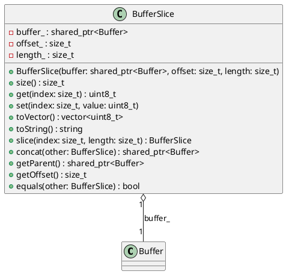

# BufferSlice

## [IMPL-CLASSES-001] Description
The `BufferSlice` class represents a view into a `Buffer` object locally or across boundaries. It holds a robust reference (shared pointer) to the underlying `Buffer` to ensure the data remains valid during the slice's lifetime. It supports reading, writing (if logical), slicing again, concatenation, and conversion.

## [IMPL-CLASSES-002] Methods
- `BufferSlice(std::shared_ptr<Buffer> buffer, size_t offset, size_t length)`: Constructs a slice.
- `size_t size() const`: Returns the size of the slice.
- `uint8_t get(size_t index) const`: Gets a byte at the relative index.
- `void set(size_t index, uint8_t value)`: Sets a byte at the relative index.
- `std::vector<uint8_t> toVector() const`: Converts slice content to a vector.
- `std::string toString() const`: Converts slice content to a hex string.
- `BufferSlice slice(size_t index, size_t length) const`: Creates a sub-slice.
- `std::shared_ptr<Buffer> concat(const BufferSlice &other) const`: Concatenates with another slice to produce a new Buffer.
- `std::shared_ptr<Buffer> getParent() const`: Returns the parent Buffer.
- `size_t getOffset() const`: Returns the offset in parent.
- `bool equals(const BufferSlice &other) const`: Checks content equality with another slice.

## [IMPL-CLASSES-003] Attributes
- `buffer_`: `std::shared_ptr<Buffer>` - The parent buffer.
- `offset_`: `size_t` - The start offset in the parent buffer.
- `length_`: `size_t` - The length of the slice.

## [IMPL-CLASSES-004] Relations
- `Buffer`: The underlying data storage.

## [IMPL-CLASSES-005] Dependencies
- `Buffer`
- `std::vector`
- `std::string`
- `std::memory`

## [IMPL-CLASSES-006] Tests
- `TestBufferSlice.cpp`: (Verified in file list)
- `TestBuffer.cpp`: Verification of `sliceView` creating valid `BufferSlice`.

## [IMPL-CLASSES-007] Examples
- Creating a slice view from a buffer:
  ```cpp
  auto buffer = std::make_shared<Buffer>(10);
  auto slice = buffer->sliceView(0, 5);
  ```
- Sub-slicing:
  ```cpp
  auto subSlice = slice->slice(1, 3);
  ```

## [IMPL-CLASSES-008] Class Diagram

