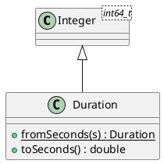

# Duration

## [IMPL-CLASSES-001] Description
The `Duration` class represents a high-precision span of time, stored as a 64-bit integer count of microseconds. 

By inheriting from `Integer<int64_t>`, it provides full support for temporal arithmetic (e.g., adding two durations, scaling a duration) and comparison. It includes utility methods for converting to and from fractional seconds.

## [IMPL-CLASSES-002] Methods
- `Duration(microseconds)`: Constructor.
- `fromSeconds(seconds)`: Static factory method. Converts a double-precision second value to a microsecond-based `Duration`.
- `toSeconds()`: Returns the duration as a floating-point number of seconds.

## [IMPL-CLASSES-004] Relations
- Inherits from `Integer<int64_t>`.

## [IMPL-CLASSES-008] Class Diagram

