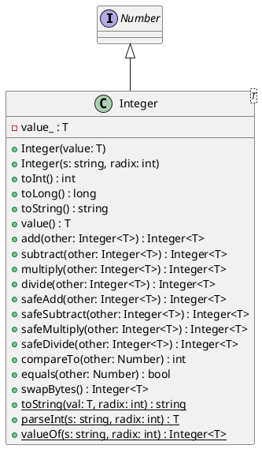

# Integer

## [IMPL-CLASSES-001] Description
The `Integer` class is a template wrapper around primitive integer types (`int8_t`, `uint8_t`, `int16_t`, `uint16_t`, `int32_t`, `uint32_t`, `int64_t`, `uint64_t`). It provides an object-oriented interface for integer operations, including arithmetic, safe arithmetic (overflow checking), string conversion with radix support, and endianness swapping. It is immutable and thread-safe.

## [IMPL-CLASSES-002] Methods
- `Integer(T value)`: Constructs an Integer from a primitive value.
- `Integer(const std::string &s, int radix)`: Constructs from a string with specified radix.
- `int toInt() const`: Converts to `int`. Throws `std::overflow_error` if value is out of range.
- `long toLong() const`: Converts to `long`. Throws `std::overflow_error` if value is out of range.
- `float toFloat() const`: Converts to `float`.
- `double toDouble() const`: Converts to `double`.
- `std::string toString() const`: Returns string representation (base 10).
- `T value() const`: Returns the underlying primitive value.
- `Integer<T> add(const Integer<T> &other) const`: Adds another Integer (wrapping behavior).
- `Integer<T> subtract(const Integer<T> &other) const`: Subtracts another Integer (wrapping behavior).
- `Integer<T> multiply(const Integer<T> &other) const`: Multiplies by another Integer (wrapping behavior).
- `Integer<T> divide(const Integer<T> &other) const`: Divides by another Integer. Throws on division by zero.
- `Integer<T> safeAdd(const Integer<T> &other) const`: Adds with overflow check. Throws `std::overflow_error`.
- `Integer<T> safeSubtract(const Integer<T> &other) const`: Subtracts with overflow check. Throws `std::overflow_error`.
- `Integer<T> safeMultiply(const Integer<T> &other) const`: Multiplies with overflow check. Throws `std::overflow_error`.
- `Integer<T> safeDivide(const Integer<T> &other) const`: Divides with overflow check. Throws `std::overflow_error`.
- `int compareTo(const Number &other) const`: Compares with any Number.
- `bool equals(const Number &other) const`: Checks equality with any Number.
- `int compareTo(const Integer<T> &other) const`: Compares with another Integer of same type.
- `bool equals(const Integer<T> &other) const`: Checks equality with another Integer of same type.
- `std::shared_ptr<Number> bitwiseAnd(const Number &other) const`: Bitwise AND.
- `std::shared_ptr<Number> bitwiseOr(const Number &other) const`: Bitwise OR.
- `std::shared_ptr<Number> bitwiseXor(const Number &other) const`: Bitwise XOR.
- `std::shared_ptr<Number> bitwiseNot() const`: Bitwise NOT.
- `std::shared_ptr<Number> bitwiseLeftShift(int amount) const`: Bitwise Left Shift.
- `std::shared_ptr<Number> bitwiseRightShift(int amount) const`: Bitwise Right Shift.
- `std::string getType() const`: Returns "Integer".
- `bool isIntegerType() const`: Returns true.
- `bool isSigned() const`: Returns true if T is signed.
- `Integer<T> swapBytes() const`: returns a new Integer with bytes swapped.
- `static std::string toString(T val, int radix)`: Static helper to convert value to string.
- `static T parseInt(const std::string &s, int radix, size_t *out_idx)`: Static helper to parse string.
- `static Integer<T> valueOf(const std::string &s, int radix)`: Factory method.

## [IMPL-CLASSES-003] Attributes
- `value_`: `T` - The underlying primitive value.

## [IMPL-CLASSES-004] Relations
- `Number`: Inherits from `Number`.

## [IMPL-CLASSES-005] Dependencies
- `std::string`
- `std::vector` (unused directly but included)
- `std::limits`
- `std::overflow_error`
- `std::runtime_error`

## [IMPL-CLASSES-006] Tests
- `TestInteger.cpp`:
    - `Arithmetic`: Verifies basic arithmetic operations.
    - `SafeArithmeticOverflow`: Verifies exception throwing on overflow.
    - `DivisionByZero`: Verifies exception on division by zero.
    - `StringRadix`: Verifies string conversion with different radices.
    - `ParseIntExceptions`: Verifies parsing error handling.
    - `CompareTo`: Verifies comparison logic.
    - `LongType`: Verifies behavior with `int64_t`.
    - `UByteType`: Verifies behavior with `uint8_t`.
    - `Endianness`: Verifies byte swapping.

## [IMPL-CLASSES-007] Examples
- Creating an integer:
  ```cpp
  Integer<int32_t> val(42);
  ```
- Parsing hex:
  ```cpp
  auto val = Integer<int32_t>::valueOf("FF", 16);
  ```
- Safe addition:
  ```cpp
  auto result = val.safeAdd(other);
  ```

## [IMPL-CLASSES-008] Class Diagram

