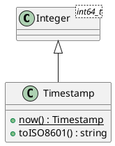

# Timestamp

## [IMPL-CLASSES-001] Description
The `Timestamp` class provides a high-precision representation of an absolute point in time. It stores the number of microseconds elapsed since the Unix epoch (January 1st, 1970, 00:00:00 UTC). 

Inheriting from `Integer<int64_t>`, it benefits from all polymorphic arithmetic and comparison operators provided by the core numeric system, while adding domain-specific temporal logic such as ISO-8601 string formatting and system clock integration.

## [IMPL-CLASSES-002] Methods
- `Timestamp(microseconds)`: Constructor. Initializes from a raw count.
- `now()`: Static factory method. Returns a `Timestamp` representing the current UTC wall-clock time.
- `toISO8601()`: Returns a standardized string representation (e.g., `"2026-04-09T14:30:00.123456Z"`).

## [IMPL-CLASSES-004] Relations
- Inherits from `Integer<int64_t>`.

## [IMPL-CLASSES-008] Class Diagram

