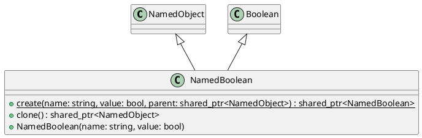

# NamedBoolean

## [IMPL-CLASSES-001] Description
`NamedBoolean` combines the functionality of `NamedObject` and `coretypes::Boolean`. It represents a named boolean value that can be part of a hierarchy.

## [IMPL-CLASSES-002] Methods
- `static std::shared_ptr<NamedBoolean> create(const std::string &name, bool value, std::shared_ptr<NamedObject> parent)`: Creates a new `NamedBoolean`.
- `virtual ~NamedBoolean()`: Destructor.
- `std::shared_ptr<NamedObject> clone() const`: Creates a deep copy of the `NamedBoolean`.
- `NamedBoolean(const std::string &name, bool value)`: Constructor.

## [IMPL-CLASSES-003] Attributes
- Inherits attributes from `NamedObject` (name, parent, etc.).
- Inherits attributes from `Boolean` (value).

## [IMPL-CLASSES-004] Relations
- `NamedObject`: Inherits from `NamedObject`.
- `Boolean`: Inherits from `coretypes::Boolean`.

## [IMPL-CLASSES-005] Dependencies
- `NamedObject`
- `coretypes::Boolean`

## [IMPL-CLASSES-006] Tests
- `TestNamedObject.cpp`:
    - `DerivedClasses`: Verifies `NamedBoolean` creation and value access.

## [IMPL-CLASSES-007] Examples
- Creating a named boolean:
  ```cpp
  auto b = NamedBoolean::create("isEnabled", true, root);
  ```
- Accessing value:
  ```cpp
  if (b->booleanValue()) { ... }
  ```

## [IMPL-CLASSES-008] Class Diagram

