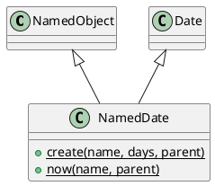

# NamedDate

## [IMPL-CLASSES-001] Description
The `NamedDate` class is a hierarchical wrapper for calendar dates. It combines the identity and tree management features of `NamedObject` with the temporal logic of `coretypes::Date`. 

It is used to represent date-based state or configuration within the Quasar registry (e.g., "installation_date", "next_maintenance"), allowing these values to be managed, serialized, and updated through the Quasar registry.

## [IMPL-CLASSES-002] Methods
- `create(name, value, parent)`: Static factory method.
- `now(name, parent)`: Static factory method. Creates a new object initialized with the current UTC date.
- `clone(policy)`: Creates a standalone copy of the date.
- `getType()`: Returns "NamedDate".
- Inherits all methods from `coretypes::Date` (e.g., `toISO8601()`, `value()`).

## [IMPL-CLASSES-004] Relations
- Inherits from `NamedObject`.
- Inherits from `quasar::coretypes::Date`.

## [IMPL-CLASSES-008] Class Diagram

