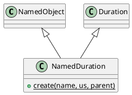

# NamedDuration

## [IMPL-CLASSES-001] Description
The `NamedDuration` class is a hierarchical wrapper for high-precision time spans. It combines the identity and tree management features of `NamedObject` with the temporal logic of `coretypes::Duration`. 

It is used to represent configurable time intervals within the system (e.g., "sample_period", "connection_timeout"), allowing these values to be managed, serialized, and updated through the Quasar registry.

## [IMPL-CLASSES-002] Methods
- `create(name, value, parent)`: Static factory method.
- `clone(policy)`: Creates a standalone copy of the duration.
- `getType()`: Returns "NamedDuration".
- Inherits all methods from `coretypes::Duration` (e.g., `toSeconds()`, `value()`).

## [IMPL-CLASSES-004] Relations
- Inherits from `NamedObject`.
- Inherits from `quasar::coretypes::Duration`.

## [IMPL-CLASSES-008] Class Diagram

