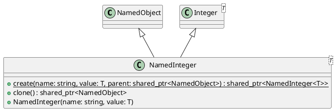

# NamedInteger

## [IMPL-CLASSES-001] Description
`NamedInteger` is a template class that combines the functionality of `NamedObject` and `coretypes::Integer`. It represents a named integer value that can be part of a hierarchy. `NamedInteger` is copyable regarding its value but retains its identity as a `NamedObject`.

## [IMPL-CLASSES-002] Methods
- `static std::shared_ptr<NamedInteger<T>> create(const std::string &name, T value, std::shared_ptr<NamedObject> parent)`: Creates a new `NamedInteger`.
- `virtual ~NamedInteger()`: Destructor.
- `std::shared_ptr<NamedObject> clone() const`: Creates a deep copy of the `NamedInteger` (value and name, but no hierarchy).
- `NamedInteger(const std::string &name, T value)`: Constructor.

## [IMPL-CLASSES-003] Attributes
- Inherits attributes from `NamedObject` (name, parent, etc.).
- Inherits attributes from `Integer` (value).

## [IMPL-CLASSES-004] Relations
- `NamedObject`: Inherits from `NamedObject`.
- `Integer`: Inherits from `coretypes::Integer`.

## [IMPL-CLASSES-005] Dependencies
- `NamedObject`
- `coretypes::Integer`

## [IMPL-CLASSES-006] Tests
- `TestNamedObject.cpp`:
    - `DerivedClasses`: Verifies that `NamedInteger` behaves correctly as a `NamedObject` and preserves its integer value.
    - `SerializationXML`: Verifies serialization of `NamedObject` which includes `NamedInteger`.
    - `SerializationYAML`: Verifies YAML serialization.

## [IMPL-CLASSES-007] Examples
- Creating a named integer:
  ```cpp
  auto val = NamedInteger<int32_t>::create("voltage", 120, systemRoot);
  ```
- Accessing value:
  ```cpp
  int v = val->value();
  ```

## [IMPL-CLASSES-008] Class Diagram

