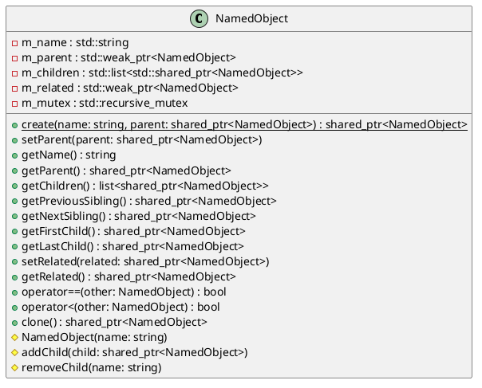

# NamedObject

## [IMPL-CLASSES-001] Description
`NamedObject` is the base class for objects that have a name and can be organized in a hierarchy (parent-child relationship). It ensures that names are unique within a parent's scope and validates name format. It also supports defining a "related" object and provides thread-safe access to its members.

## [IMPL-CLASSES-002] Methods
- `static std::shared_ptr<NamedObject> create(const std::string &name, std::shared_ptr<NamedObject> parent)`: Creates a new `NamedObject`. Throws if name is invalid or not unique.
- `void setParent(std::shared_ptr<NamedObject> parent)`: Sets the parent. Throws if name is not unique in new parent or if a cycle is detected.
- `std::string getName() const`: Returns the name of the object.
- `std::shared_ptr<NamedObject> getParent() const`: Returns the parent object.
- `std::list<std::shared_ptr<NamedObject>> getChildren() const`: Returns a list of children.
- `std::shared_ptr<NamedObject> getPreviousSibling() const`: Returns the previous sibling.
- `std::shared_ptr<NamedObject> getNextSibling() const`: Returns the next sibling.
- `std::shared_ptr<NamedObject> getFirstChild() const`: Returns the first child.
- `std::shared_ptr<NamedObject> getLastChild() const`: Returns the last child.
- `void setRelated(std::shared_ptr<NamedObject> related)`: Sets a related object (weak reference).
- `std::shared_ptr<NamedObject> getRelated() const`: Returns the related object.
- `bool operator==(const NamedObject &other) const`: Checks equality based on name.
- `bool operator<(const NamedObject &other) const`: Compares based on name (lexicographical).
- `virtual std::shared_ptr<NamedObject> clone() const`: Creates a clone of this object (without hierarchy).
- `NamedObject(const std::string &name)`: Protected constructor.
- `void addChild(std::shared_ptr<NamedObject> child)`: Internal helper to add a child.
- `void removeChild(const std::string &name)`: Internal helper to remove a child.

## [IMPL-CLASSES-003] Attributes
- `m_name`: `std::string` - The name of the object.
- `m_parent`: `std::weak_ptr<NamedObject>` - Weak reference to the parent.
- `m_children`: `std::list<std::shared_ptr<NamedObject>>` - List of children.
- `m_related`: `std::weak_ptr<NamedObject>` - Weak reference to a related object.
- `m_mutex`: `mutable std::recursive_mutex` - Mutex for thread safety.

## [IMPL-CLASSES-004] Relations
- `NamedObject`: Self-referential for parent, children, siblings, and related objects.

## [IMPL-CLASSES-005] Dependencies
- `std::list`
- `std::vector`
- `std::string`
- `std::memory` (`shared_ptr`, `weak_ptr`)
- `std::mutex` (`recursive_mutex`)

## [IMPL-CLASSES-006] Tests
- `TestNamedObject.cpp`:
    - `Creation`: Verifies creation and initial state.
    - `InvalidName`: Verifies name validation logic (e.g., must be alphanumeric/underscore).
    - `Hierarchy`: Verifies parent-child relationships and sibling navigation.
    - `Uniqueness`: Verifies name uniqueness within a parent.
    - `CycleDetection`: Verifies prevention of cyclic parent-child chains.
    - `DerivedClasses`: Verifies behavior with derived classes like `NamedInteger`.
    - `SerializationXML`: Verifies XML serialization of the object.
    - `SerializationYAML`: Verifies YAML serialization of the object.

## [IMPL-CLASSES-007] Examples
- Creating a hierarchy:
  ```cpp
  auto root = NamedObject::create("root");
  auto child = NamedObject::create("child", root);
  ```
- Navigating siblings:
  ```cpp
  auto sibling = child->getNextSibling();
  ```

## [IMPL-CLASSES-008] Class Diagram

