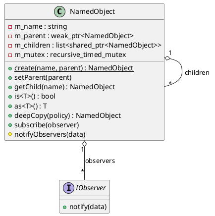

# NamedObject

## [IMPL-CLASSES-001] Description
The `NamedObject` class is the fundamental building block of the Quasar framework's hierarchical data model. It provides a thread-safe foundation for organizing objects into a tree structure, where each object has a unique identifier (name) within its parent's scope. 

Key responsibilities include:
- **Hierarchy Management**: Maintaining parent-child relationships using a combination of shared pointers (downwards) and weak pointers (upwards) to prevent reference cycles.
- **Thread Safety**: Protecting all internal state-modifying operations with a recursive timed mutex, ensuring integrity in multi-threaded environments.
- **Identity and Validation**: Enforcing strict naming rules (alphanumeric identifiers) and ensuring name uniqueness within each branch of the tree.
- **Reflexivity Helpers**: Providing template-based utilities for runtime type identification and safe downcasting.
- **Event Dispatch**: Implementing a lightweight observer pattern for broadcasting state changes or custom events.

## [IMPL-CLASSES-002] Methods
- `create(name, parent)`: Static factory method. Validates the name and ensures uniqueness before returning a managed shared pointer.
- `setParent(parent)`: Moves the object within the hierarchy. Handles detaching from old parent and attaching to new one.
- `getName()`, `setName(name)`: Accessors for the object identifier.
- `getParent()`, `getChildren()`: Navigation accessors.
- `getChild(name)`: Efficiently retrieves a specific child by its unique name.
- `getPreviousSibling()`, `getNextSibling()`: Navigates peer objects under the same parent.
- `getFirstChild()`, `getLastChild()`: Boundary navigation for children.
- `setRelated(obj)`, `getRelated()`: Manages non-hierarchical "weak" links between objects.
- `getType()`: Returns the class type as a string (default: "NamedObject").
- `is<T>()`: Template helper to check if the object is of type `T` or derived from it.
- `as<T>()`: Template helper to safely cast and retrieve a shared pointer of type `T`.
- `replaceInTree(replacement)`: Swaps this object with another, inheriting its parent and transferring all children.
- `clone(policy)`: Creates a shallow copy of the object (name and state).
- `deepCopy(policy)`: Recursively clones the entire subtree starting from this object.
- `subscribe(observer)`, `unsubscribe(observer)`: Manages event listeners.
- `notifyObservers(data)`: Broadcasts an event payload to all active subscribers.

## [IMPL-CLASSES-003] Attributes
- `m_name`: `std::string` - The object's unique identifier.
- `m_parent`: `std::weak_ptr<NamedObject>` - Upwards link to the containing object.
- `m_children`: `std::list<std::shared_ptr<NamedObject>>` - Downwards links to contained objects.
- `m_related`: `std::weak_ptr<NamedObject>` - Link to an associated but non-parental object.
- `m_mutex`: `mutable std::recursive_timed_mutex` - The primary synchronization primitive.
- `m_observers`: `std::vector<std::weak_ptr<IObserver>>` - Registry of event listeners.

## [IMPL-CLASSES-004] Relations
- `NamedObject` is self-referential, forming the tree topology.
- Uses `IObserver` for event-driven behavior.

## [IMPL-CLASSES-008] Class Diagram

```plantuml
@startuml
class NamedObject {
    - m_name : string
    - m_parent : weak_ptr<NamedObject>
    - m_children : list<shared_ptr<NamedObject>>
    - m_mutex : recursive_timed_mutex
    + {static} create(name, parent) : NamedObject
    + setParent(parent)
    + getChild(name) : NamedObject
    + is<T>() : bool
    + as<T>() : T
    + deepCopy(policy) : NamedObject
    + subscribe(observer)
    # notifyObservers(data)
}
interface IObserver {
    + notify(data)
}
NamedObject "1" o-- "*" NamedObject : children
NamedObject "1" o-- "*" IObserver : observers
@endluml
```
