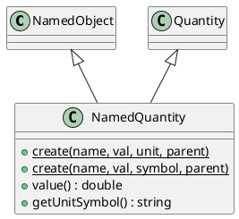

# NamedQuantity

## [IMPL-CLASSES-001] Description
The `NamedQuantity` class is a hierarchical wrapper for physical values. It combines the identity and tree management features of `NamedObject` with the dimensional safety and unit conversion logic of `coretypes::Quantity`. 

This class is essential for representing sensor data or physical configurations (e.g., "bus_voltage", "motor_speed") within the Quasar registry. It ensures that these values carry their physical context (units) and allows for safe mathematical operations and automatic engineering unit conversions.

## [IMPL-CLASSES-002] Methods
- `create(name, value, unit, parent)`: Static factory method using a fully typed `Unit`.
- `create(name, value, symbol, parent)`: Static factory method using a symbolic-only unit name.
- `value()`: Returns the raw numeric value.
- `getUnitSymbol()`: Returns the unit symbol (e.g., "m/s", "V").
- `clone(policy)`: Creates a standalone copy of the quantity.
- `getType()`: Returns "NamedQuantity".
- Inherits all physical logic from `coretypes::Quantity` (e.g., `convertTo()`).

## [IMPL-CLASSES-004] Relations
- Inherits from `NamedObject`.
- Inherits from `quasar::coretypes::Quantity`.

## [IMPL-CLASSES-008] Class Diagram

