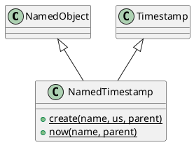

# NamedTimestamp

## [IMPL-CLASSES-001] Description
The `NamedTimestamp` class is a hierarchical wrapper for high-precision temporal data. It combines the identity and tree management features of `NamedObject` with the temporal logic of `coretypes::Timestamp`. 

This class is used to represent time-based state or configuration within the Quasar registry (e.g., "last_update", "mission_start"), allowing these timestamps to be discovered, monitored, and serialized alongside other system data.

## [IMPL-CLASSES-002] Methods
- `create(name, value, parent)`: Static factory method.
- `now(name, parent)`: Static factory method. Creates a new object initialized with the current system time.
- `clone(policy)`: Creates a standalone copy of the timestamp.
- `getType()`: Returns "NamedTimestamp".
- Inherits all methods from `coretypes::Timestamp` (e.g., `toISO8601()`, `value()`).

## [IMPL-CLASSES-004] Relations
- Inherits from `NamedObject`.
- Inherits from `quasar::coretypes::Timestamp`.

## [IMPL-CLASSES-008] Class Diagram

