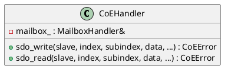

# CoEHandler

## [IMPL-CLASSES-001] Description
The `CoEHandler` class implements the CANopen over EtherCAT (CoE) protocol. It provides a high-level API for Service Data Object (SDO) upload and download operations. It supports expedited transfers and initial logic for normal/segmented transfers, enabling the master to read and write slave parameters (Object Dictionary).

## [IMPL-CLASSES-002] Methods
- `CoEHandler(MailboxHandler &mailbox)`: Constructor.
- `CoEError sdo_write(SlaveInfo &slave, uint16_t index, uint8_t subindex, std::span<const byte> data, bool complete_access, std::chrono::microseconds timeout)`: Performs an SDO Download (Write).
- `CoEError sdo_read(SlaveInfo &slave, uint16_t index, uint8_t subindex, std::span<byte> data, size_t &actual_size, bool complete_access, std::chrono::microseconds timeout)`: Performs an SDO Upload (Read).
- `CoEError handle_sdo_abort(uint16_t slave_addr, uint16_t index, uint8_t subindex, uint32_t abort_code)`: Internal helper to log and handle SDO abort codes.

## [IMPL-CLASSES-003] Attributes
- `mailbox_`: `MailboxHandler&` - Reference to the mailbox transport handler.

## [IMPL-CLASSES-004] Relations
- Uses `MailboxHandler` for transport.
- Depends on `SlaveInfo` for mailbox configuration.

## [IMPL-CLASSES-005] Dependencies
- `resoem/MailboxHandler.hpp`
- `resoem/EtherCATTypes.hpp`

## [IMPL-CLASSES-006] Tests
- `test_coe_upload.cpp`: Verifies reading device names and vendor IDs using SDO Upload.

## [IMPL-CLASSES-007] Examples
- Reading a device name:
  ```cpp
  CoEHandler coe(mailbox);
  byte buffer[64];
  size_t size;
  coe.sdo_read(slave, 0x1008, 0x00, buffer, size);
  ```

## [IMPL-CLASSES-008] Class Diagram

