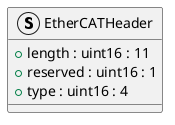

# EtherCATHeader

## [IMPL-CLASSES-001] Description
The `EtherCATHeader` struct represents the standard 2-byte EtherCAT frame header. It contains the length of the datagrams, a reserved bit, and the frame type.

## [IMPL-CLASSES-002] Methods
- Implicit default constructor and copy constructor.

## [IMPL-CLASSES-003] Attributes
- `length`: `uint16_t` (11 bits) - Length of the EtherCAT payload (datagrams).
- `reserved`: `uint16_t` (1 bit) - Reserved.
- `type`: `uint16_t` (4 bits) - Protocol type (1 for EtherCAT commands).

## [IMPL-CLASSES-004] Relations
- Used by `FrameBuilder` and `EtherCATFrame`.

## [IMPL-CLASSES-005] Dependencies
- None.

## [IMPL-CLASSES-006] Tests
- `test_broadcast_read.cpp`: Verifies frame construction.

## [IMPL-CLASSES-007] Examples
- Structure layout matches the wire format.

## [IMPL-CLASSES-008] Class Diagram

