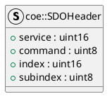

# SDOHeader

## [IMPL-CLASSES-001] Description
The `coe::SDOHeader` struct represents the standard header for CANopen over EtherCAT (CoE) SDO (Service Data Object) messages. It is used for both Expedited and Normal/Segmented SDO transfers.

## [IMPL-CLASSES-002] Methods
- Implicit default constructor.

## [IMPL-CLASSES-003] Attributes
- `service`: `uint16_t` - Contains the CoE service type (bits 12-15) and number (bits 0-8). Usually initialized with `SDO_REQUEST` or `SDO_RESPONSE`.
- `command`: `uint8_t` - The SDO command specifier (e.g., Download, Upload, Abort).
- `index`: `uint16_t` - The Object Dictionary index.
- `subindex`: `uint8_t` - The Object Dictionary sub-index.

## [IMPL-CLASSES-004] Relations
- Used by `CoEHandler`.

## [IMPL-CLASSES-005] Dependencies
- `resoem/EtherCATTypes.hpp` (enums)

## [IMPL-CLASSES-006] Tests
- `test_coe_upload.cpp` (via `CoEHandler`).

## [IMPL-CLASSES-007] Examples
- Initializing an upload request:
  ```cpp
  sdo.command = coe::SDO_UPLOAD_REQ;
  sdo.index = 0x1000;
  sdo.subindex = 0;
  ```

## [IMPL-CLASSES-008] Class Diagram

