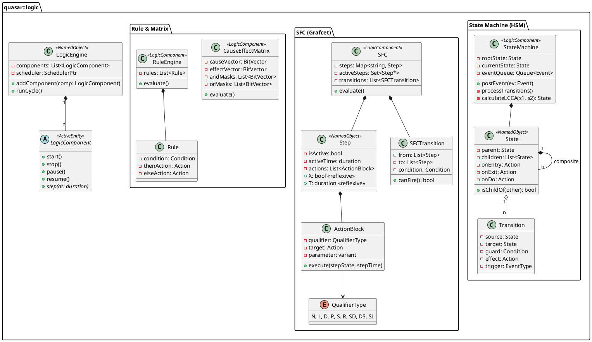

# Goal

Implement a comprehensive, **custom-built** logic and control engine (LogicEngine) within the Quasar framework. This engine shall provide runtime-definable support for State Machines, Sequential Function Charts (SFC/Grafcet), and Rule Engines. These components shall be integrated into the `NamedObject` hierarchy and leverage `ActiveEntity` for execution and reflexivity.

# Details

## Context

Industrial automation and complex system control require formal logic modeling to ensure deterministic and maintainable behavior. This **custom implementation** focuses on **runtime flexibility**, allowing logic models to be defined, modified, and loaded at runtime via Lua scripts or serialization formats (JSON/SCXML/IEC62881-XML).

## Proposed UML Model



## Requirements

### [TSK-20260311-009.1] Core Logic Project
- [ ] [TSK-20260311-009.1.1] Create a new sub-project `cmake-projects/logicengine`.
- [ ] [TSK-20260311-009.1.2] Define base interfaces for `ICondition`, `IAction`, and `ITrigger` using `NamedObject` for parameters and state.
- [ ] [TSK-20260311-009.1.3] Implement `BitVector` utility for high-performance logic operations (mapping to `std::vector<uint64_t>` or `std::bitset`).

### [TSK-20260311-009.2] State Machine (FSM/HSM) Support (UML 2.5.1 / OPC UA Part 16)
- [ ] [TSK-20260311-009.2.1] Implement a **custom Dynamic State Machine engine** supporting nested states, regions, and transitions.
- [ ] [TSK-20260311-009.2.2] Implement a runtime **Least Common Compound Ancestor (LCCA)** algorithm for precise transition exit/entry sequence calculation.
- [ ] [TSK-20260311-009.2.3] Implement UML 2.5.1 Pseudo-states: Initial, Final, Shallow History, Deep History, Choice, and Junction.
- [ ] [TSK-20260311-009.2.4] Enforce **Run-to-Completion (RTC)** event semantics with internal and external event queues.
- [ ] [TSK-20260311-009.2.5] Support **Microstep** vs **Macrostep** execution boundaries for SCXML compliance.
- [ ] [TSK-20260311-009.2.6] Align with **OPC UA Part 16** (StateType, TransitionType, FiniteStateMachineType).

### [TSK-20260311-009.3] Sequential Function Chart (SFC) / Grafcet (IEC 61131-3:2025)
- [ ] [TSK-20260311-009.3.1] Implement SFC Step and Transition nodes in `NamedObject` tree.
- [ ] [TSK-20260311-009.3.2] Implement **Action Control Blocks (ACB)** with support for all standard Qualifiers: **N, L, D, P, S, R, SD, DS, SL**.
- [ ] [TSK-20260311-009.3.3] Implement the **Active Steps Algorithm** ($O(n_{active})$ evaluation).
- [ ] [TSK-20260311-009.3.4] Support Simultaneous (AND) and Selection (OR) convergence/divergence logic.
- [ ] [TSK-20260311-009.3.5] Standardize reflexive suffixes: `.X` (Active), `.T` (Elapsed time), `.ActivationFlag`.

### [TSK-20260311-009.4] Rule Engine & Cause-Effect Matrix (IEC 62881)
- [ ] [TSK-20260311-009.4.1] Implement `CauseEffectMatrix` with bit-parallel evaluation using `BitVector`.
- [ ] [TSK-20260311-009.4.2] Optimize AND/OR matrix evaluation:
    - `Effect[i] = ((Inputs & AndMask[i]) == AndMask[i]) | ((Inputs & OrMask[i]) != 0)`.
- [ ] [TSK-20260311-009.4.3] Support Latching (L) and Timed (T) effect behaviors.

### [TSK-20260311-009.5] Integration & Scripting
- [ ] [TSK-20260311-009.5.1] Create `LogicBuilder` for Lua to define complex machines via DSL:
    ```lua
    fsm:state("Idle"):onEntry(function() ... end):transition("Run", "StartEvent")
    ```
- [ ] [TSK-20260311-009.5.2] Integrate with `Serialization` for SCXML import/export.

# Implementation Strategy

1.  **Architecture**: `LogicComponent` inherits from `ActiveEntity`. All logic nodes (States, Steps) are `NamedObject`s.
2.  **Execution Loop**: The `LogicEngine` runs at a fixed frequency (or on-demand). Each cycle updates timers (`dt`) and processes the logic specific to the component.
3.  **HSM Engine**: Uses a dynamic table of transitions. Priority is innermost-first (descendant states take precedence).
4.  **SFC Engine**: Maintains a set of active step pointers. Evaluates transitions once per cycle. ACBs are evaluated after the step state update.
5.  **C&E Engine**: Uses 64-bit word vectors to process 64 causes simultaneously for each effect.

# Test and validation

- **SCXML Test Suite**: Run the W3C SCXML IRP tests on the core HSM engine.
- **PLCopen Compliance**: Validate SFC qualifier timing against the PLCopen standard test cases.
- **Performance**: Benchmark 1024x1024 C&E matrix evaluation on target hardware (ARM/x86).
- **Stress**: Verify thread safety when modifying guards or triggers via Lua while the engine is running.

# Status

- [x] Refined specification
- [ ] Implementation in progress
- [ ] Completed
